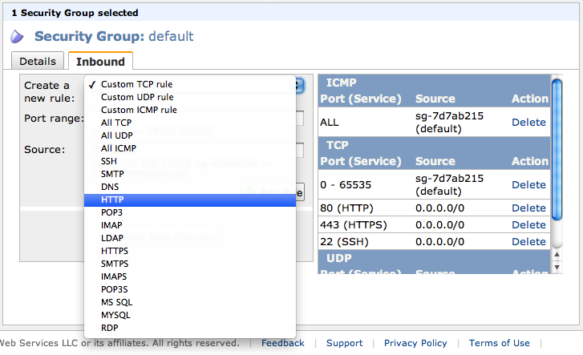
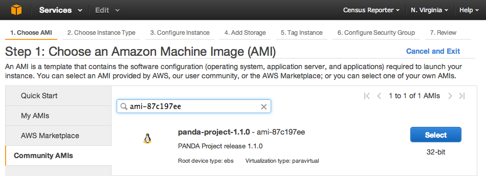

========================
Installing on Amazon EC2
========================

Step 1. Register for EC2
========================

If you don't already have an Amazon Web Services account, you will need to register for one and set up your credentials. Visit the `EC2 homepage <http://aws.amazon.com/ec2/>`_ and follow the "Sign Up Now" link.

This process may take a few minutes and you will be required to verify your identity using a phone.

.. note::

    Although every effort has been made to make this process as streamlined as possible, if you've never set up a server before, you may find it rather daunting. In this case we suggest pairing up with an engineer until you are through the setup process.

Step 2. Configure your Security Group
=====================================

Before setting up your PANDA server, you will need to configure your security group so that web requests will be able to reach it.

To do this, visit the `Security Groups section <https://console.aws.amazon.com/ec2/home?#s=SecurityGroups>`_ of the EC2 Management Console. Select the "default" security group from the list, and then click the "Inbound" tab in the bottom pane of the window. Add rules for ``HTTP``, ``HTTPS`` and ``SSH``.

If you don't mind your PANDA being accessible to anyone on the internet, you can enter ``0.0.0.0/0`` in the **Source** field for each. **This will make your PANDA visible to the public.** (Although it's highly unlikely anyone would find it unless you gave them the link.) More discerning users will want to enter a private IP or subnet assigned to their organization.

.. note::

    If you're not sure what to enter for the **Source** field it would be wise to consult with your IT department to find out if your organization has a private IP or subnet.

Step 3. Launch your server
==========================

Method #1 - Use an Amazon Machine Instance (AMI)
------------------------------------------------

This is the absolute simplest way to make a PANDA. Visit the `Instances section <https://console.aws.amazon.com/ec2/home?#s=Instances>`_ and click "Launch Instance". Select "Launch Classic Wizard" and click "Continue". Click the "Community AMIs" tab and search for ``ami-ef27f986``. It may take a moment to return a result. When it does, click "Select".

.. _notes above regarding instance types:

On the next page you'll need to select an **Instance Type**. You are welcome to use (and pay for) a more powerful server, but PANDA has been optimized with the expectation that most organizations will run it on an ``m1.small`` instance. (At a cost of roughly $70 per month.) This should provide adequate capacity for small- to medium-sized groups. We don't recommend trying to run it on a ``t1.micro`` unless you will only be using it for testing.

Once you've selected your instance type, skip over **Availability Zone** and click "Continue". Keep clicking "Continue" and accepting all the default options until the "Continue" button becomes a "Launch" button. Click "Launch".

.. note::

    If you have never used Amazon EC2 before you will be required to create a keypair. Even if you don't know what this is, **don't lose it or delete it**. It is the only way to log into your PANDA server if you ever need to.

Method #2 - Use a script over SSH
---------------------------------

This method is slightly more complex and assumes you have some experience operating servers. It also provides greater feedback for users who want to understand more about how PANDA works.

Visit the `Instances section <https://console.aws.amazon.com/ec2/home?#s=Instances>`_ and click "Launch Instance". Select "Launch Class Wizard" and click "Continue". Click the "Community AMIs" tab and search for ``ami-baba68d3``. This is the official Ubuntu 11.10 AMI. It may take a moment to return a result. When it does, click "Select".

On the next page you'll need to select an **Instance Type**. See the `notes above regarding instance types`_. We recommend you select ``m1.small``.

Click "Continue" and keep clicking "Continue" and accepting all the default options until the "Continue" button becomes a "Launch" button. Click "Launch".

Once your new server is available, SSH into it and execute the following commands::

    wget https://raw.github.com/pandaproject/panda/0.1.1/setup_panda.sh
    sudo bash setup_panda.sh

The disadvantage of this method is that you will need to wait while the setup script is run. This normally takes 15-20 minutes.

.. note::

    An installation log will be created at ``/var/log/panda-install.log`` in case you need to review any part of the process.

Step 4. Check your PANDA
------------------------

Once you've completed your selected installation method you'll want to verify that your new PANDA is available. You can browse directly using to your instance using its "Public DNS Name". Navigate to the EC2 `Instances section <https://console.aws.amazon.com/ec2/home?#s=Instances>`_ and select your instance. The public DNS name will be listed among the instance details in the bottom pane. It will look something like this: ``ec2-50-16-157-39.compute-1.amazonaws.com``. Visit this in your browser, like so::

    http://ec2-50-16-157-39.compute-1.amazonaws.com/

You can login using the default user credentials::

    Username: user@pandaproject.net
    Password: user

Or the default administrator credentials::

    Username: panda@pandaproject.net
    Password: panda

Once you have verified that your instance is online you may wish to configure :doc:`DNS <dns>`, :doc:`E-mail <email>` and/or :doc:`Secure connections (SSL) <ssl>`.
