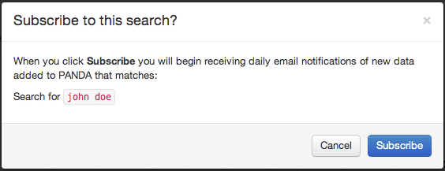
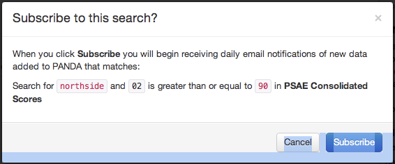

=============================
Subscribing to search results
=============================

PANDA makes it possible to subscribe to a search so that you will be notified whenever new data appears which matches your query. For example, if you subscribed to a search for "John Doe" then when a new dataset of homicides was uploaded you would get a notification showing the rows for unidentified victims.

You may also subscribe to a search within a specific dataset.

Subscriptions also work for category searches, those with complex operators and individual column searches. To subscribe to a search click the *Subscribe to search results* button at the top of any search reusults page.

.. note::

    Search subscriptions are executed overnight, *not* when the new data is uploaded. You will receive your notifications early in the AM.

    If you have email enabled these notifications will be delivered through email, otherwise you can access them via the notifications dropdown in the toolbar across the top of your PANDA.

You can managed your subscribed searches on your User page. Just click your email address in the toolbar at the top of your PANDA.

