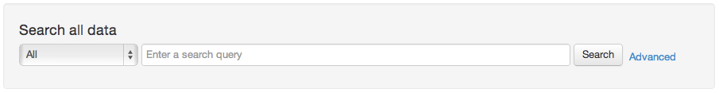
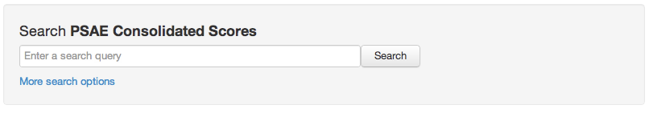
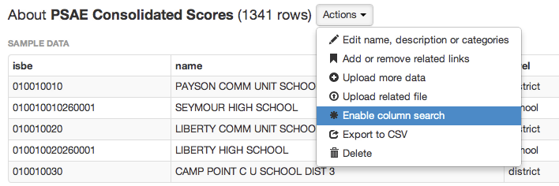
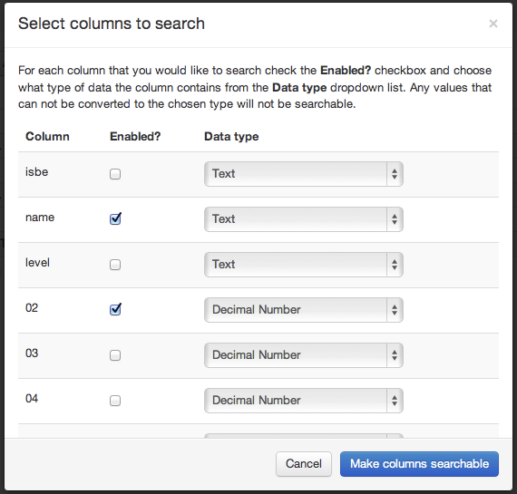
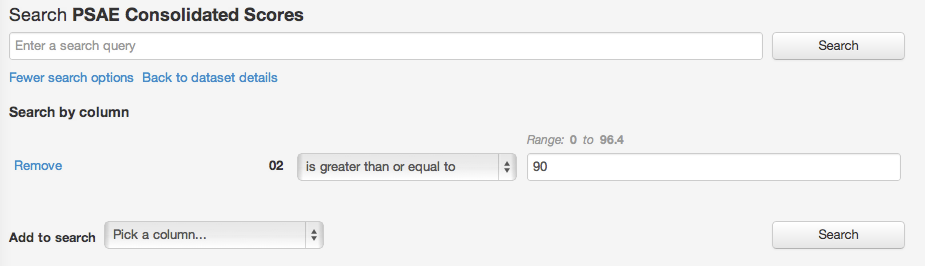

============
Finding data
============

PANDA provides to important ways of searching for data. From the "Search" page you can search across data in all datasets that have been uploaded to PANDA. This is typically used for research. From an individual dataset's page you can search the data for just that one dataset. This is appropriate if you are looking for a very specific row or rows of data.

Searching across all datasets
=============================

To search across all datasets click the "Search" link from the navigation bar across the top of the screen. (This is also the default homepage for PANDA.) You will see a search form at the top of the page.

Enter your search keywords. The more detailed your search, the fewer results you should expect to get. Keep in mind that the order of the terms doesn't matter, so if you are searching for a particular individual you can input the name as "first last" or "last first" without affecting the results.

PANDA can not know about variations in terms, such as plurals or mispellings. (Though it will attempt to automatically match nicknames!) If you need to search for such variations you will want to consult the advanced search features. Hover your mouse over the word "Advanced" for details.

As an example, searching for ``doe AND (jon OR john OR jane)`` will (barring typos) find all John and Jane Doe's in any dataset.

Once you have your query constructed click the "Search" button. On the resulting page you will see a list of datasets that had matching data, with some example rows from each. If there are more results than could be displayed in the preview there will be a "View more results from this dataset" link that will take you to complete search within that specific dataset.

Searching all data within a category
====================================

You can also search across just those datasets within specific category. This functions exactly like the search described in the previous section except that you will also want to select a category from the drop down immediately to the left of the search box. (Displaying "All" in the image above.) Only datasets within the selected category will be searched.

There is currently no way to search across more than one category at a time.

Searching within a single dataset
=================================

To search across a specific dataset visit its details page. At the top of that page you will see a search box.

This search field functions identically to the universal search function described above, with the exception that it only searches within a single dataset. For details of how to use advanced search syntax or to search specific columns, click the "More search options" link.

To learn how to search *for datasets*, rather than data, read :doc:`searching_datasets`.

Searching specific columns of data within a dataset
===================================================

PANDA makes it possible to search within specific columns of data within a dataset. When this feature is enabled you will be able to search a column's data in a way that is natural for its "type". For instance, in a column of whole numbers can be search for values "greater than 100". A columns of dates can be searched for only those in a specific year.

Enabling column search
----------------------

Because per-column search requires additional processing and storage, it is not enabled for any columns by default. (For very large datasets you should consult with your administrator before you enable it.) In order to enable column search visit your dataset's details page and select "Enable column search" from the *Actions* menu.

In the window which appears check the "Enabled?" checkbox for each column that you want to be able to search. PANDA will make an effort to guess the "Data type" for each column, but you should verify these are what you expect and correct them if not. Once you've made your selections, click *Make columns searchable*.

This will cause your dataset to be reindexed with the new columns enabled for search.

Searching within a column
-------------------------

Once your dataset has finished reindexing you will be able to search a column by clicking the "More search options" link and then selecting the column name from the "Pick a column..." dropdown. The resulting search options will vary depending on the type of the column. In the following image a decimal number column called "02" (referring to the second period of test results) is searched for scores "greater than or equal to" 90.

Multiple columns can be searched at once and these can be combined with a normal full-text search. Any column indexed as "Text" will also support the same advanced search operations as the normal search.

