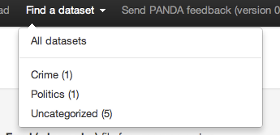

================
Finding datasets
================

In addition to searching for rows of data within datasets, PANDA can also be used to search for datasets themselves. Once found datasets can be exported to CSV or the original files can be redownloaded.

Searching for a dataset
=======================

To search for a dataset click the "Find a Dataset" link in the navigation bar at the top of the page. A dropdown will appear from which you can choose to search all datasets or only those within a specific category.

Once you've made a selection you'll find yourself on the dataset search page. This search form works exactly the same as :doc:`the one you use for searching data <searching_data>`, except in this case we are searching the information *about* the datasets, rather than the data within them.

Please note that *all* information shown in the results table is searchable, including the column names. For information on advanced search features hover your mouse over the "Advanced" link.

Getting data out
================

Once you've found a dataset you may wish to download it from of PANDA for further analysis. There are two possible ways of doing this--downloading the original file that was uploaded or exporting the dataset.

If you want the file that was originally uploaded to PANDA, simply click the name of the file on the dataset's detail page. It will begin downloading immediately.

If the dataset in PANDA has multiple data files uploaded or has been modified via the API, you may wish to download the current version of the complete dataset. To do this click the "Actions" dropdown on its details page and then select "Export to CSV". This process may take some time. A link to the exported file will be emailed to you when the export is complete.

