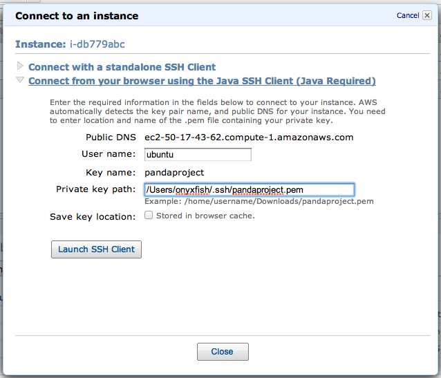
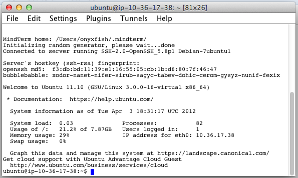

===================
Connecting with SSH
===================

When performing :doc:`upgrades <upgrades>`, adding :doc:`storage <storage>` or doing advanced maintainence on your PANDA you will need to login over SSH. At its most basic, SSH is a way of communicating with your server via a secure text interface. This quick guide will explain how to SSH into your PANDA server using Amazon EC2's Java SSH client.

.. note::

    If for some reason the Java SSH client doesn't work for you, you will need to connect with a different SSH client. Describing this is beyond the scope of this documentation, however, Amazon does provide complete SSH documentation for both `Linux/Mac <http://docs.amazonwebservices.com/AWSEC2/latest/UserGuide/AccessingInstancesLinux.html>`_ and `Windows <http://docs.amazonwebservices.com/AWSEC2/latest/UserGuide/putty.html>`_.

To use to the Java SSH client first navigate to your EC2 `Instances tab <https://console.aws.amazon.com/ec2/home?region=us-east-1&#s=Instances>`_. Find your instance in the list, right-click on it and select "Connect". You should see a dialog like this:

In this dialog set the **User name** to ``ubuntu`` as shown in the image above.

You will also need to set the **Private key path**. This is the location on your computer of the private key file you created when you setup your EC2 account. The name of your key will be the one specified in the **Key name** field and it will have a ``.pem`` extension. For example, the key in the above example is named ``pandaproject.pem``. Unfortunantely, Amazon doesn't provide a "file picker" to use to find the file, so you will need to type out the complete location of the file. Here are some example locations.

* If you are on Windows XP and your key is in ``My Documents`` then the full path might be ``C:\Documents and Settings\USERNAME\My Documents\KEYNAME.pem``.
* If you are on Windows 7 and your keys in ``Downloads`` then the full path might be ``C:\Users\USERNAME\Downloads\KEYNAME.pem``.
* If you are on Mac OSX and your key is in ``Downloads`` then the full path might be ``/Users/USERNAME/Downloads/KEYNAME.pem``.
* If you are on Linux and your key is in your home directory then the full path might be ``/home/USERNAME/KEYNAME.pem``.

Once you have this information keyed in, click "Launch SSH Client".

You will see several dialogs prompting you to allow the software to access your computer and to accept the software's Terms of Service. It is safe to accept each of these. After connecting the software will also prompt you to create some folders on the server. Accept these as well. Once you've made your way through these dialogs, you should see a window that looks something like this:

You've made it! This is your SSH terminal. From here you can enter commands as described in any of the other sections of this documentation. When you've finished using the SSH connection, select "Exit" from the "File" menu to disconnect.

