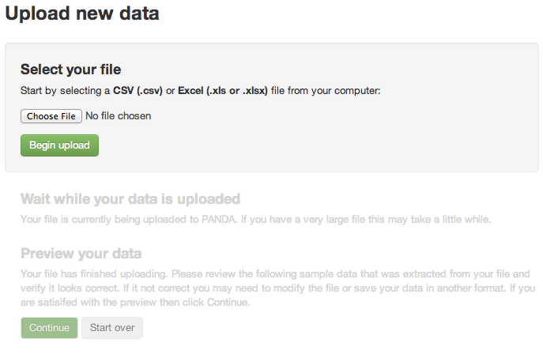
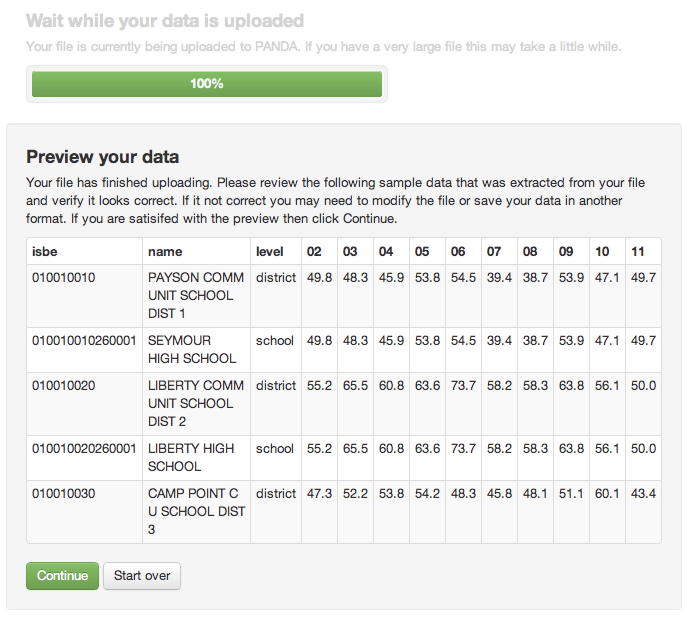
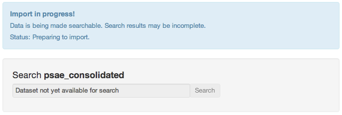
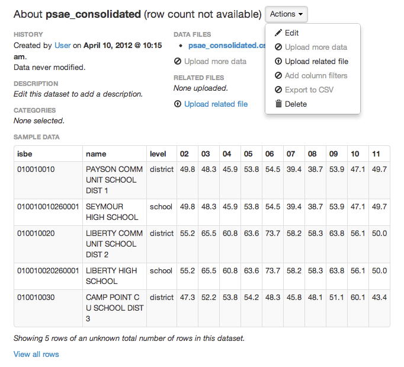

==============================
Uploading your data into PANDA
==============================

The most important thing that you can do with PANDA is upload your datasets to it. By doing so you not only ensure they are securely stored away, but also allow everyone in your newsroom to access that data on their own.

Selecting a file
================

To upload data to PANDA first click "Upload" on the navigation bar that runs along the top of the screen. You will be presented with an upload form that looks like this:

Click the "Choose File" button and find your dataset on your local computer. You can upload both CSV and Excel (.xls, .xlsx) files into PANDA.

Depending on the type of file you have selected PANDA may prompt you with some additional questions. Do your best to answer these and then click "Begin upload". Your file is now uploading to PANDA. Depending on how large it is and the speed of your connection this could take anywhere for a few seconds to several hours.

Previewing your data
====================

Once your file has finished uploading you will see a preview of your data, like this:

Please note that you may need to scroll left and right in the preview table to see all of your data. You should verify that the data appears how you expect it to. If you realize that this isn't the data you wanted to upload or that it requires some cleanup before importing, you can click "Start over" delete the data and restart the upload process.

If the data is acceptable click "Continue".

Adding details about your dataset
=================================

Your dataset will now begin importing and you will be taken to the dataset's new details page. A notification will alert you that the data is importing. (Unless your dataset is very small, in which case it might already be done when you reach this page!)

On the dataset details page you can see all the information about your newly uploaded dataset, including some sample data. From here you can also upload any related files (such as FOIA documentation) and perform other tasks. While your data is importing the most important thing you can do is give it a proper title and description. You can do this by clicking on the "Actions" dropdown and selecting "Edit".

In the Edit window you can give your dataset a better **Name**, add a detailed **Description** and assign it to any appropriate **Categories** your administrator has created. Please note that all information in these fields is searchable, so it's very valuable to add relevant details to the **Description** field, such as the extent of the dataset or how it was acquired.

That's it! Your dataset will continue to import on its own. If your administrator has configured email you will receive an email when it is finished. If not the "Notifications" counter in the upper-right of your PANDA window will turn blue.

To learn how to search your data read :doc:`searching_data`.

